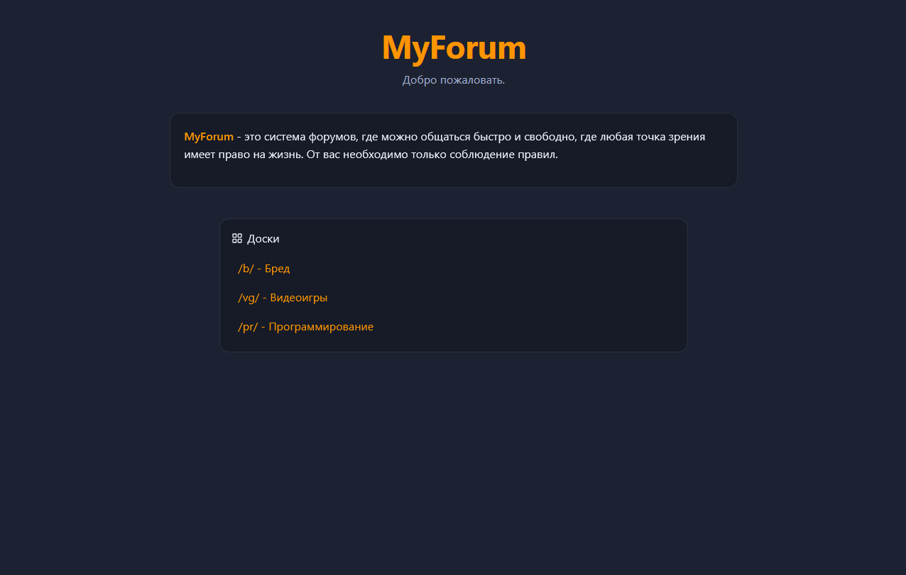
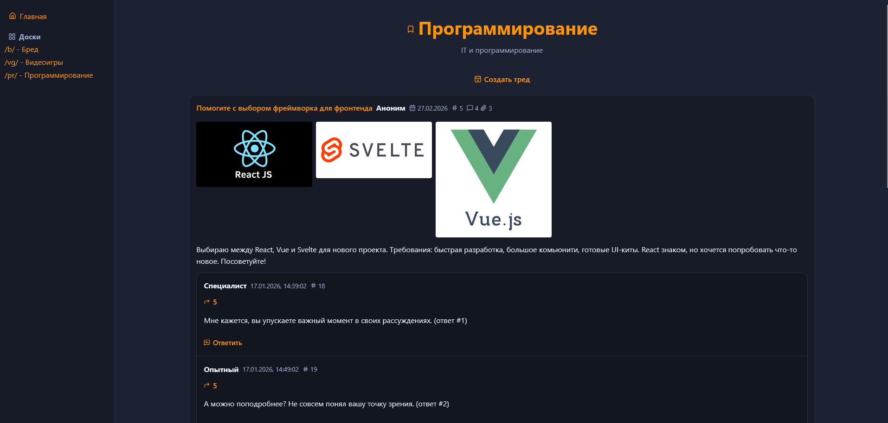
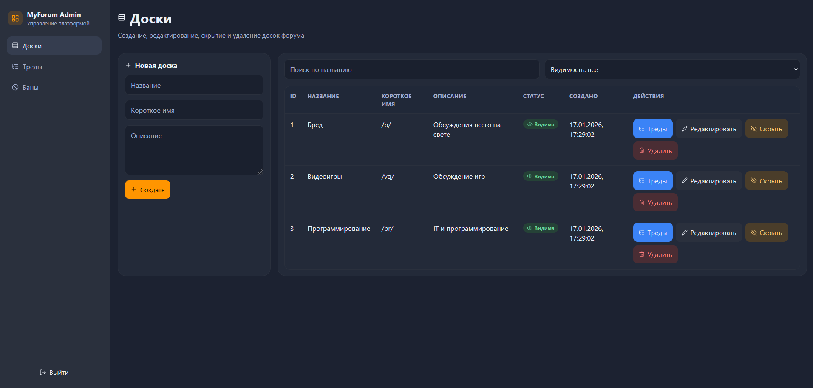
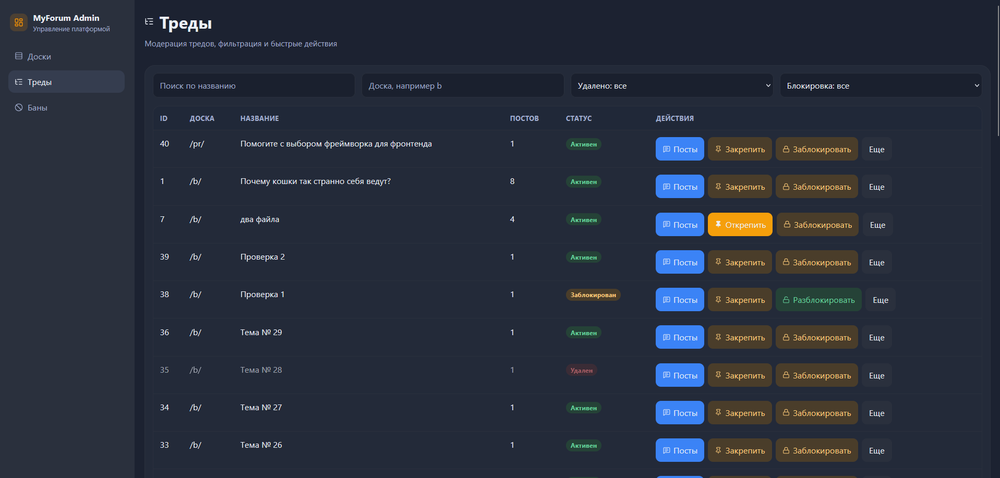
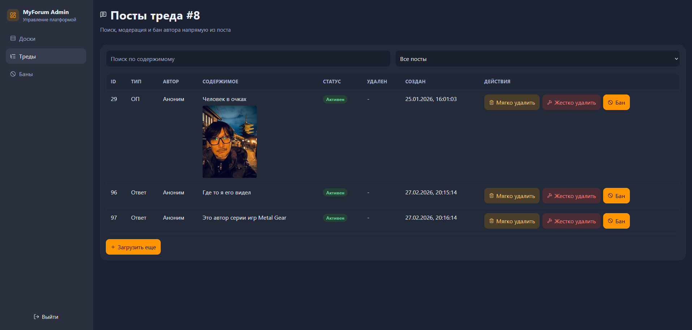
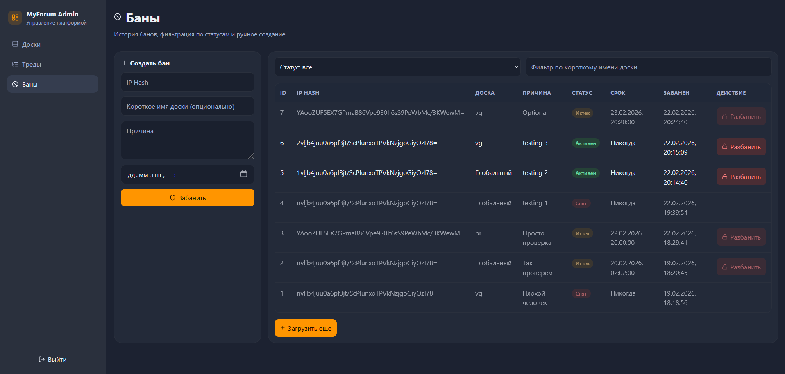
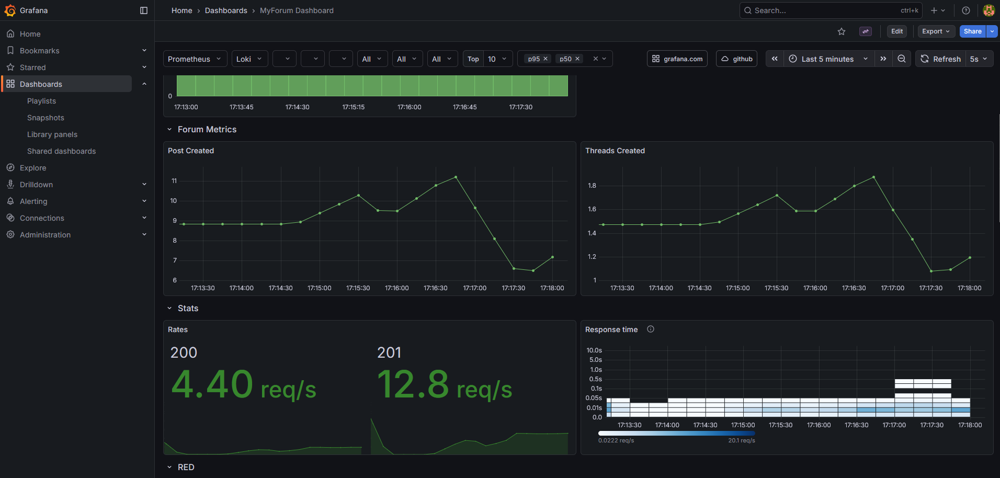

# MyForum

[](https://dotnet.microsoft.com/en-us/download/dotnet/9.0)


[](https://www.docker.com/get-started)

Пет-проект анонимного имиджборд-форума с отдельной админ-панелью и инфраструктурой мониторинга.

Проект показывает полный цикл разработки: от доменной модели и REST API до клиентского интерфейса, модерации, хранения файлов, кэширования и мониторинга.

## Elevator Pitch

`MyForum` - это fullstack-приложение в стиле имиджборда:

- публичная часть для чтения досок, создания тредов и ответов;
- админ-панель для модерации контента (доски, треды, посты, баны);
- backend с PostgreSQL, Redis и MinIO;
- метрики и логи через Prometheus + Grafana + Loki.

## Технологии

- Backend: `ASP.NET Core 9`, `Entity Framework Core 9`, `FluentValidation`, `AutoMapper`
- База данных: `PostgreSQL 18`
- Кэш: `Redis`
- Объектное хранилище файлов: `MinIO`
- Логирование: `Serilog`, `Loki`, `Promtail`
- Метрики: `OpenTelemetry`, `Prometheus`, `Grafana`
- Frontend (публичный): `React 19`, `TypeScript`, `Vite`
- Frontend (админка): `React 19`, `TypeScript`, `Vite`, `TanStack Query`, `Axios`
- Контейнеризация: `Docker`, `Docker Compose`
- Тесты: `xUnit`, `Moq`, `FluentAssertions`, `EF Core InMemory`

## Основные фичи

### Публичная часть форума

- Список досок (`/`)
- Страница доски с тредами (`/:boardShortName`)
- Страница треда с постами (`/:boardShortName/:threadId`)
- Создание треда с ОП-постом
- Создание ответов в треде
- Ответ на конкретный пост (`replyToPostId`)
- Загрузка файлов к постам с превью изображений
- Курсорная пагинация и infinite scroll для тредов и постов
- Ограничения и валидация на размер/количество/типы файлов
- Блокировка публикации для забаненных пользователей (по хэшу IP)

### Админ-панель (`/admin/`)

- Cookie-auth для staff-аккаунтов
- Управление досками:
  - создание, редактирование, удаление
  - скрытие/показ доски (`IsHidden`)
- Модерация тредов:
  - soft delete / hard delete / restore
  - lock/unlock
  - pin/unpin
  - фильтрация по статусам и поиску
- Модерация постов:
  - soft delete / hard delete / restore
  - бан автора поста
- Управление банами:
  - создание глобального или board-specific бана
  - фильтрация (active/expired/revoked)
  - разбан

## Архитектура и структура репозитория

```text
MyForum/
├─ MyForum.Api/         # ASP.NET Core API, домен, сервисы, репозитории, миграции
├─ MyForum.Api.Tests/   # Unit-тесты сервисов, репозиториев и валидаторов
├─ MyForum.Web/         # Публичный frontend (React + TS)
├─ MyForum.Admin/       # Админ-панель (React + TS)
├─ nginx/               # Reverse proxy + статика forum/admin
├─ grafana/             # Provisioning и dashboard
├─ docker-compose.yml   # Полный стек в контейнерах
└─ README.md
```

Backend построен по слоям:

- `Core`: сущности, DTO, интерфейсы, валидации, исключения
- `Infrastructure`: `DbContext`, миграции, репозитории, сервисы, health checks
- `Controllers`: публичные и админские API-endpoints

## Как запустить локально

### Вариант 1 (рекомендуется): весь стек через Docker Compose

1. Клонируйте репозиторий:

```bash
git clone https://github.com/Fl1ckerxD/MyForum.git
cd MyForum
```

2. Скопировать переменные окружения:

```bash
cp .env.example .env
```

3. При необходимости отредактировать `.env` (пароли/логины).

4. Запустить проект:

```bash
docker compose up --build
```

5. Открыть сервисы:

- Форум: `http://localhost/`
- Админка: `http://localhost/admin/`
- Grafana: `http://localhost:3000`
- Prometheus: `http://localhost:9090`
- MinIO Console: `http://localhost:9001`

#### Тестовые пользователи

При первом запуске в системе создаются несколько тестовых пользователей:

- Администратор:
  - Логин: admin
  - Пароль: admin

### Вариант 2: backend локально, инфраструктура в контейнерах

1. Поднять инфраструктуру (PostgreSQL, Redis, MinIO, мониторинг):

```bash
docker compose up db redis minio loki promtail prometheus grafana -d
```

2. Установить переменные окружения для API (PowerShell):

```powershell
$env:POSTGRES_USER="postgres"
$env:POSTGRES_PASSWORD="<your_password>"
$env:MINIO_ACCESS_KEY="minioadmin"
$env:MINIO_SECRET_KEY="<your_password>"
```

3. Запустить API:

```bash
dotnet run --project MyForum.Api
```

4. Запустить фронтенды в dev-режиме (в отдельных терминалах):

```bash
cd MyForum.Web
npm ci
npm run dev
```

```bash
cd MyForum.Admin
npm ci
npm run dev
```

Примечание: в dev-конфиге фронтенды используют API по адресу `http://localhost:80/api`, поэтому для корректной интеграции удобнее использовать docker-compose с `nginx`.

## Миграции и сиды

- Миграции EF Core применяются автоматически при старте API (`SeedData.SeedAsync`).
- При пустой БД сидятся:
  - стартовые доски/треды/посты;
  - staff-аккаунты: `admin/admin`, `mod/mod`, `mod2/mod`.

## Тестирование

```bash
dotnet test MyForum.Api.Tests
```

Покрыты:

- валидаторы (`CreateThreadRequest`, `CreatePostRequest`)
- сервисы (`ThreadService`, `PostService`, `MinioFileService`, `SHA256IPHasher`)
- репозитории (`Board`, `Thread`, `Post`, `PostFile`)

## Нагрузочное тестирование (k6)

В репозитории есть базовый пользовательский нагрузочный сценарий: `MyForum.Api.Tests/load/k6-user-flow.js`.

Сценарий эмулирует реальный flow:

- получение доски;
- создание треда;
- открытие созданного треда;
- публикация нескольких ответов в тред.

Запуск:

```bash
k6 run MyForum.Api.Tests/load/k6-user-flow.js
```

С переменными окружения:

```bash
k6 run -e BASE_URL=http://localhost:80 -e BOARD_SHORT_NAME=b MyForum.Api.Tests/load/k6-user-flow.js
```

Текущая конфигурация сценария:

- `vus: 10`
- `duration: 1m`

Примечание: это smoke/load сценарий для быстрой проверки пользовательского потока под нагрузкой и регрессий API, а не полноценный capacity/performance benchmark.

## Демонстрация

### Публичная часть

**Главная страница**



**Страница доски**



### Админ-панель

**Доски**



**Треды**



**Посты**



**Баны**



### Мониторинг

**Grafana dashboard**



## Что реализовано лично мной

В рамках этого pet-проекта реализовал:

- backend-архитектуру (слои `Core` / `Infrastructure` / `Controllers`);
- REST API для публичной части и модерации;
- работу с PostgreSQL через EF Core + миграции;
- кэширование данных досок через Redis;
- файловое хранилище на MinIO + генерацию превью изображений;
- админ-аутентификацию на cookie-based схеме;
- soft/hard delete и инструменты модерации;
- систему банов по IP hash (глобальных и по доскам);
- мониторинг: health checks, метрики, централизованные логи, Grafana;
- unit-тесты сервисного и репозиторного уровней;
- контейнеризацию всего стека через Docker Compose.

## Roadmap / TODO

- Добавить e2e-тесты (например, Playwright) для пользовательских и админ-сценариев
- Добавить CI pipeline (lint + tests + build images)
- Улучшить RBAC для модераторов на уровне отдельных досок
- Вынести конфиг фронтендов (API URL) в env-переменные
- Добавить seed-скрипты для разных окружений (dev/demo)
- Добавить OpenAPI/Swagger-документацию публичного и admin API

## Контакты

- Email: `mihaylov.slava@outlook.com`
- Telegram: `@Fl1cker_0`
- Issues: `https://github.com/Fl1ckerxD/MyForum/issues`
